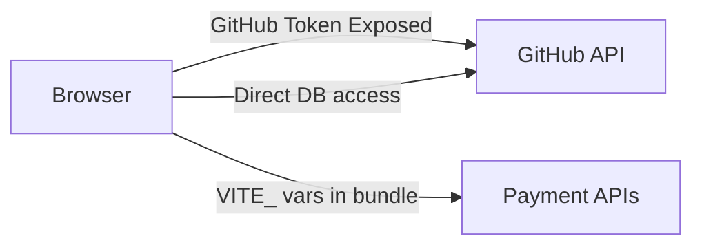
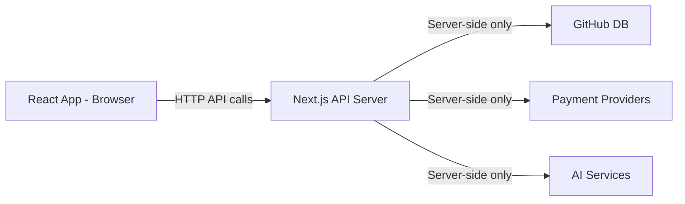

# GoShop Monorepo Implementation Guide

> **Bismillah Ar-Rahman Ar-Raheem**

This document provides a comprehensive guide for converting the GoShop platform from a single React/Vite application to a secure monorepo architecture with a dedicated Next.js backend.

---

## Table of Contents

1. [Executive Summary](#executive-summary)
2. [Current Architecture Analysis](#current-architecture-analysis)
3. [Target Architecture](#target-architecture)
4. [Monorepo Structure](#monorepo-structure)
5. [File Migration Mapping](#file-migration-mapping)
6. [API Routes Specification](#api-routes-specification)
7. [Environment Variables Restructuring](#environment-variables-restructuring)
8. [Implementation Guide](#implementation-guide)
9. [Integration Points](#integration-points)
10. [Testing & Verification](#testing--verification)

---

## Executive Summary

### Current Issues
The current GoShop implementation has **critical security vulnerabilities** due to:
- GitHub API token exposed in client-side code via `VITE_GITHUB_TOKEN`
- All database operations executed directly from the browser
- Payment provider credentials accessible in client bundles
- No server-side authentication/authorization layer
- Passwords stored without hashing

### Solution
Convert to a **monorepo with two applications**:
1. **`apps/web`** - React/Vite frontend (current app, UI only)
2. **`apps/api`** - Next.js API server (new, handles all sensitive operations)

### Key Principle
> **All database interactions, authentication, payment processing, and sensitive logic MUST move to the Next.js app. The React app becomes a pure UI layer that calls the Next.js API.**

---

## Current Architecture Analysis

### Sensitive Files Requiring Migration

| File | Purpose | Security Risk |
|------|---------|---------------|
| `src/lib/commerce-sdk.ts` | GitHub DB operations | **CRITICAL** - Token exposed client-side |
| `src/lib/sdk.ts` | Universal SDK for DB | **CRITICAL** - Token exposed client-side |
| `src/lib/auth.ts` | JWT verification | **HIGH** - JWT secret in client code |
| `src/lib/paypal-client.ts` | PayPal integration | **CRITICAL** - Credentials exposed |
| `src/lib/ai.ts` | AI service integration | **HIGH** - API key exposure |
| `src/pages/api/*.ts` | Payment handlers | Already server-side design, needs migration |

### Current Data Flow (INSECURE)


### Files Currently Using import.meta.env

```
src/lib/commerce-sdk.ts:436 → VITE_GITHUB_TOKEN
src/lib/commerce-sdk.ts:437 → VITE_GITHUB_OWNER  
src/lib/commerce-sdk.ts:438 → VITE_GITHUB_REPO
src/lib/commerce-sdk.ts:529 → VITE_CLOUDINARY_CLOUD_NAME
src/lib/commerce-sdk.ts:530 → VITE_CLOUDINARY_UPLOAD_PRESET
src/pages/api/initiate-payment.ts:21,66,67,94 → VITE_APP_URL
```

---

## Target Architecture

### Secure Data Flow


### Architecture Principles
1. **React App**: Pure UI, no direct database access, no credentials
2. **Next.js API**: All sensitive operations, authentication, authorization
3. **Shared Package**: Types, utilities, validation schemas (no credentials)

---

## Monorepo Structure

```
goshop/
├── package.json                    # Root workspace configuration
├── turbo.json                      # Turborepo configuration (optional)
├── pnpm-workspace.yaml             # PNPM workspace config
│
├── apps/
│   ├── web/                        # React/Vite Frontend (existing app)
│   │   ├── package.json
│   │   ├── vite.config.ts
│   │   ├── src/
│   │   │   ├── components/         # Keep as-is
│   │   │   ├── pages/              # Keep as-is (remove /api folder)
│   │   │   ├── context/            # Modify to use API client
│   │   │   ├── hooks/              # Keep as-is
│   │   │   ├── lib/
│   │   │   │   ├── api-client.ts   # NEW: HTTP client for Next.js API
│   │   │   │   ├── utils.ts        # Keep as-is
│   │   │   │   └── validation.ts   # Move to shared package
│   │   │   └── ...
│   │   └── .env.local              # Only VITE_API_URL
│   │
│   └── api/                        # Next.js Backend (NEW)
│       ├── package.json
│       ├── next.config.js
│       ├── src/
│       │   ├── app/
│       │   │   └── api/            # API Routes
│       │   │       ├── auth/
│       │   │       │   ├── login/route.ts
│       │   │       │   ├── register/route.ts
│       │   │       │   ├── logout/route.ts
│       │   │       │   └── me/route.ts
│       │   │       ├── products/
│       │   │       │   ├── route.ts
│       │   │       │   └── [id]/route.ts
│       │   │       ├── orders/
│       │   │       │   ├── route.ts
│       │   │       │   └── [id]/route.ts
│       │   │       ├── cart/
│       │   │       │   └── route.ts
│       │   │       ├── wishlist/
│       │   │       │   └── route.ts
│       │   │       ├── payments/
│       │   │       │   ├── initiate/route.ts
│       │   │       │   ├── paystack/callback/route.ts
│       │   │       │   ├── paypal/capture/route.ts
│       │   │       │   ├── flutterwave/callback/route.ts
│       │   │       │   └── razorpay/callback/route.ts
│       │   │       ├── wallet/
│       │   │       │   └── route.ts
│       │   │       ├── stores/
│       │   │       │   └── route.ts
│       │   │       ├── users/
│       │   │       │   └── route.ts
│       │   │       ├── categories/
│       │   │       │   └── route.ts
│       │   │       ├── notifications/
│       │   │       │   └── route.ts
│       │   │       ├── community/
│       │   │       │   ├── posts/route.ts
│       │   │       │   └── comments/route.ts
│       │   │       ├── admin/
│       │   │       │   └── ...
│       │   │       ├── seller/
│       │   │       │   └── ...
│       │   │       └── affiliate/
│       │   │           └── ...
│       │   │
│       │   ├── lib/
│       │   │   ├── github-db.ts    # GitHub database operations
│       │   │   ├── auth.ts         # Authentication utilities
│       │   │   ├── paypal.ts       # PayPal integration
│       │   │   ├── paystack.ts     # Paystack integration
│       │   │   ├── flutterwave.ts  # Flutterwave integration
│       │   │   ├── razorpay.ts     # Razorpay integration
│       │   │   ├── cloudinary.ts   # Image upload handling
│       │   │   ├── ai.ts           # AI service integration
│       │   │   └── session.ts      # Session management
│       │   │
│       │   ├── middleware.ts       # Auth middleware
│       │   └── types/              # Server-side types
│       │
│       └── .env.local              # ALL secrets (NOT VITE_ prefixed)
│
└── packages/
    └── shared/                     # Shared utilities and types
        ├── package.json
        ├── src/
        │   ├── types/              # Shared TypeScript interfaces
        │   │   ├── user.ts
        │   │   ├── product.ts
        │   │   ├── order.ts
        │   │   └── ...
        │   ├── validation/         # Zod schemas
        │   │   └── schemas.ts
        │   └── utils/              # Shared utilities
        │       └── index.ts
        └── tsconfig.json
```

---

## File Migration Mapping

### Files to DELETE from React App

| Current Location | Reason |
|-----------------|--------|
| `src/lib/commerce-sdk.ts` | Contains GitHub credentials & direct DB access |
| `src/lib/sdk.ts` | Contains GitHub credentials & direct DB access |
| `src/lib/auth.ts` | Server-side only authentication |
| `src/lib/paypal-client.ts` | Contains payment credentials |
| `src/lib/ai.ts` | Contains AI API keys |
| `src/pages/api/*` | Move to Next.js API routes |

### Files to CREATE in Next.js App

#### 1. Database Layer (`apps/api/src/lib/github-db.ts`)

Migrate all database operations from `commerce-sdk.ts`:

| commerce-sdk.ts Method | New API Route | HTTP Method |
|----------------------|---------------|-------------|
| `getData(collection)` | `/api/{collection}` | GET |
| `saveData(collection, data)` | Internal only | - |
| `get<T>(collection)` | `/api/{collection}` | GET |
| `update(collection, id, data)` | `/api/{collection}/[id]` | PATCH |
| `delete(collection, id)` | `/api/{collection}/[id]` | DELETE |

#### 2. Authentication Layer (`apps/api/src/lib/auth.ts`)

| commerce-sdk.ts Method | New API Route | HTTP Method |
|----------------------|---------------|-------------|
| `login(credentials)` | `/api/auth/login` | POST |
| `register(userData)` | `/api/auth/register` | POST |
| `logout()` | `/api/auth/logout` | POST |
| `getCurrentUser()` | `/api/auth/me` | GET |

#### 3. Product Operations

| commerce-sdk.ts Method | New API Route | HTTP Method |
|----------------------|---------------|-------------|
| `getProducts(filters?)` | `/api/products` | GET |
| `getProduct(id)` | `/api/products/[id]` | GET |
| `createProduct(data, images)` | `/api/products` | POST (multipart) |
| `updateProduct(id, data, images)` | `/api/products/[id]` | PATCH |
| `deleteProduct(id)` | `/api/products/[id]` | DELETE |
| `searchProducts(query, filters)` | `/api/products?search=...` | GET |
| `getSellerProducts(sellerId)` | `/api/products?sellerId=...` | GET |

#### 4. Order Operations

| commerce-sdk.ts Method | New API Route | HTTP Method |
|----------------------|---------------|-------------|
| `getOrders(userId?)` | `/api/orders` | GET |
| `getOrder(id)` | `/api/orders/[id]` | GET |
| `createOrder(orderData)` | `/api/orders` | POST |
| `updateOrderStatus(id, status)` | `/api/orders/[id]/status` | PATCH |

#### 5. Cart Operations

| commerce-sdk.ts Method | New API Route | HTTP Method |
|----------------------|---------------|-------------|
| `getCart(userId)` | `/api/cart` | GET |
| `addToCart(userId, productId, qty)` | `/api/cart` | POST |
| `updateCartQuantity(id, qty)` | `/api/cart/[id]` | PATCH |
| `removeFromCart(id)` | `/api/cart/[id]` | DELETE |
| `clearCart()` | `/api/cart` | DELETE |

#### 6. Payment Operations

| Current File | New API Route | Notes |
|-------------|---------------|-------|
| `initiate-payment.ts` | `/api/payments/initiate` | Move as-is |
| `paystack-callback.ts` | `/api/payments/paystack/callback` | Webhook |
| `paypal-capture-payment.ts` | `/api/payments/paypal/capture` | Callback |
| `flutterwave-callback.ts` | `/api/payments/flutterwave/callback` | Webhook |
| `razorpay-callback.ts` | `/api/payments/razorpay/callback` | Webhook |

#### 7. Wallet Operations

| commerce-sdk.ts Method | New API Route | HTTP Method |
|----------------------|---------------|-------------|
| `getWallet(userId)` | `/api/wallet` | GET |
| `fundWallet(...)` | `/api/wallet/fund` | POST |
| `payWithWallet(...)` | `/api/wallet/pay` | POST |
| `getWalletTransactions(userId)` | `/api/wallet/transactions` | GET |
| `createWithdrawalRequest(...)` | `/api/wallet/withdraw` | POST |

#### 8. Store Operations

| commerce-sdk.ts Method | New API Route | HTTP Method |
|----------------------|---------------|-------------|
| `getStores()` | `/api/stores` | GET |
| `getStore(id)` | `/api/stores/[id]` | GET |
| `getStoreBySlug(slug)` | `/api/stores?slug=...` | GET |
| `createStore(data)` | `/api/stores` | POST |
| `updateStore(id, data)` | `/api/stores/[id]` | PATCH |
| `getSellerStore(sellerId)` | `/api/stores?sellerId=...` | GET |

#### 9. Community Operations

| commerce-sdk.ts Method | New API Route | HTTP Method |
|----------------------|---------------|-------------|
| `getPosts()` | `/api/community/posts` | GET |
| `createPost(data)` | `/api/community/posts` | POST |
| `updatePost(id, data)` | `/api/community/posts/[id]` | PATCH |
| `getComments(postId)` | `/api/community/posts/[id]/comments` | GET |
| `createComment(data)` | `/api/community/posts/[id]/comments` | POST |
| `moderatePost(id, action)` | `/api/admin/posts/[id]/moderate` | POST |

#### 10. Admin Operations

| commerce-sdk.ts Method | New API Route | HTTP Method |
|----------------------|---------------|-------------|
| `getPlatformAnalytics()` | `/api/admin/analytics` | GET |
| `getHelpArticles()` | `/api/admin/help-articles` | GET |
| `createHelpArticle(data)` | `/api/admin/help-articles` | POST |
| `getPlatformCommissions()` | `/api/admin/commissions` | GET |
| `updatePlatformCommission(...)` | `/api/admin/commissions/[id]` | PATCH |
| `getRefundRequests(...)` | `/api/admin/refunds` | GET |
| `updateRefundRequest(...)` | `/api/admin/refunds/[id]` | PATCH |
| `getWithdrawalRequests(...)` | `/api/admin/withdrawals` | GET |

#### 11. Affiliate Operations

| commerce-sdk.ts Method | New API Route | HTTP Method |
|----------------------|---------------|-------------|
| `getAffiliateLinks(id)` | `/api/affiliate/links` | GET |
| `createAffiliateLink(data)` | `/api/affiliate/links` | POST |
| `getAffiliateCollections(id)` | `/api/affiliate/collections` | GET |
| `createAffiliateCollection(data)` | `/api/affiliate/collections` | POST |
| `trackAffiliateClick(code)` | `/api/affiliate/track` | POST |
| `getAffiliateProducts()` | `/api/affiliate/products` | GET |

---

## API Routes Specification

### Authentication Endpoints

```typescript
// POST /api/auth/register
Request: { email, password, name, role?, businessName?, phone? }
Response: { user, token }

// POST /api/auth/login  
Request: { email, password }
Response: { user, token }

// POST /api/auth/logout
Request: { } (uses cookie/header token)
Response: { success: true }

// GET /api/auth/me
Headers: { Authorization: Bearer <token> }
Response: { user }
```

### Product Endpoints

```typescript
// GET /api/products
Query: { category?, sellerId?, featured?, search?, page?, limit? }
Response: { products: Product[], total, page, totalPages }

// GET /api/products/[id]
Response: { product: Product }

// POST /api/products (Auth: Seller)
Request: FormData { name, description, price, images[], ... }
Response: { product: Product }

// PATCH /api/products/[id] (Auth: Seller, owner only)
Request: FormData { updates... }
Response: { product: Product }

// DELETE /api/products/[id] (Auth: Seller, owner only)
Response: { success: true }
```

### Order Endpoints

```typescript
// GET /api/orders (Auth required)
Query: { status?, page?, limit? }
Response: { orders: Order[] }

// GET /api/orders/[id] (Auth required, owner only)
Response: { order: Order }

// POST /api/orders (Auth required)
Request: { cartItems, shippingInfo, paymentMethod }
Response: { order: Order }

// PATCH /api/orders/[id]/status (Auth: Seller/Admin)
Request: { status, trackingNumber? }
Response: { order: Order }
```

### Payment Endpoints

```typescript
// POST /api/payments/initiate (Auth required)
Request: { orderId, paymentMethod }
Response: { redirectUrl? } | { razorpayOrderId? } | { transactionId? }

// POST /api/payments/paystack/callback (Webhook)
// POST /api/payments/paypal/capture?orderId=...
// POST /api/payments/flutterwave/callback (Webhook)
// POST /api/payments/razorpay/callback (Webhook)
```

---

## Environment Variables Restructuring

### React App (`apps/web/.env.local`)

```bash
# ONLY non-sensitive, public configuration
VITE_API_URL=http://localhost:3001  # Next.js API URL
VITE_APP_NAME=GoShop
```

> **CRITICAL**: Remove ALL other VITE_ variables. The React app should NEVER have access to:
> - GitHub tokens
> - Payment API keys
> - Database credentials
> - JWT secrets

### Next.js API (`apps/api/.env.local`)

```bash
# GitHub Database (Server-side only)
GITHUB_TOKEN=ghp_your_personal_access_token
GITHUB_OWNER=your_github_username
GITHUB_REPO=your_database_repo_name

# Authentication
JWT_SECRET=your_very_long_random_secret_key_here
SESSION_SECRET=another_random_secret_for_sessions
COOKIE_SECURE=true
COOKIE_DOMAIN=.yourdomain.com

# PayPal
PAYPAL_CLIENT_ID=your_paypal_client_id
PAYPAL_CLIENT_SECRET=your_paypal_client_secret
PAYPAL_MODE=sandbox  # or 'live'

# Paystack
PAYSTACK_SECRET_KEY=sk_test_your_paystack_key

# Flutterwave
FLUTTERWAVE_SECRET_KEY=FLWSECK_TEST-your_key

# Razorpay
RAZORPAY_KEY_ID=rzp_test_your_key_id
RAZORPAY_KEY_SECRET=your_razorpay_secret

# Cloudinary (server-side signed uploads)
CLOUDINARY_CLOUD_NAME=your_cloud_name
CLOUDINARY_API_KEY=your_api_key
CLOUDINARY_API_SECRET=your_api_secret

# AI Service
CHUTES_AI_API_KEY=your_ai_api_key

# Application
APP_URL=https://yourdomain.com
API_URL=https://api.yourdomain.com
CORS_ORIGINS=https://yourdomain.com,http://localhost:5173
```

---

## Implementation Guide

### Step 1: Initialize Monorepo

```bash
# Create new directory structure
mkdir goshop-monorepo
cd goshop-monorepo

# Initialize pnpm workspace
pnpm init

# Create pnpm-workspace.yaml
cat > pnpm-workspace.yaml << 'EOF'
packages:
  - 'apps/*'
  - 'packages/*'
EOF

# Create root package.json
cat > package.json << 'EOF'
{
  "name": "goshop-monorepo",
  "private": true,
  "scripts": {
    "dev": "turbo run dev",
    "build": "turbo run build",
    "lint": "turbo run lint"
  },
  "devDependencies": {
    "turbo": "^2.0.0"
  }
}
EOF

# Create turbo.json
cat > turbo.json << 'EOF'
{
  "$schema": "https://turbo.build/schema.json",
  "tasks": {
    "build": {
      "dependsOn": ["^build"],
      "outputs": ["dist/**", ".next/**"]
    },
    "dev": {
      "cache": false,
      "persistent": true
    },
    "lint": {}
  }
}
EOF
```

### Step 2: Move Existing React App

```bash
# Create apps directory
mkdir -p apps

# Move existing app to apps/web
# (Copy your current goshop-beta folder to apps/web)
cp -r /path/to/goshop-beta apps/web

# Update apps/web/package.json name
# "name": "@goshop/web"
```

### Step 3: Create Next.js API App

```bash
# Create Next.js app
cd apps
npx -y create-next-app@latest api --typescript --app --src-dir --no-tailwind --eslint

# Navigate to api app
cd api

# Install dependencies
pnpm add jsonwebtoken bcryptjs cookies-next zod
pnpm add @paypal/checkout-server-sdk razorpay
pnpm add -D @types/jsonwebtoken @types/bcryptjs
```

### Step 4: Create Shared Package

```bash
# Create shared package
mkdir -p packages/shared/src

# Create package.json
cat > packages/shared/package.json << 'EOF'
{
  "name": "@goshop/shared",
  "version": "1.0.0",
  "main": "./src/index.ts",
  "types": "./src/index.ts",
  "dependencies": {
    "zod": "^3.25.0"
  }
}
EOF
```

### Step 5: Implement GitHub DB Module

Create `apps/api/src/lib/github-db.ts`:

```typescript
// This is the SERVER-SIDE ONLY database module
// All GitHub operations happen here, credentials never leave the server

const GITHUB_TOKEN = process.env.GITHUB_TOKEN!;
const GITHUB_OWNER = process.env.GITHUB_OWNER!;
const GITHUB_REPO = process.env.GITHUB_REPO!;

class GitHubDB {
  private baseURL = 'https://api.github.com';
  
  private headers() {
    return {
      'Authorization': `Bearer ${GITHUB_TOKEN}`,
      'Accept': 'application/vnd.github.v3+json',
      'Content-Type': 'application/json'
    };
  }
  
  async get<T>(collection: string): Promise<T[]> {
    // Implementation from commerce-sdk.ts
  }
  
  async insert<T>(collection: string, item: Partial<T>): Promise<T> {
    // Implementation from commerce-sdk.ts
  }
  
  async update<T>(collection: string, id: string, updates: Partial<T>): Promise<T> {
    // Implementation from commerce-sdk.ts
  }
  
  async delete(collection: string, id: string): Promise<boolean> {
    // Implementation from commerce-sdk.ts
  }
}

export const db = new GitHubDB();
```

### Step 6: Implement Authentication

Create `apps/api/src/lib/auth.ts`:

```typescript
import jwt from 'jsonwebtoken';
import bcrypt from 'bcryptjs';
import { cookies } from 'next/headers';
import { db } from './github-db';

const JWT_SECRET = process.env.JWT_SECRET!;
const COOKIE_NAME = 'goshop_session';

export async function hashPassword(password: string): Promise<string> {
  return bcrypt.hash(password, 12);
}

export async function verifyPassword(password: string, hash: string): Promise<boolean> {
  return bcrypt.compare(password, hash);
}

export function generateToken(userId: string): string {
  return jwt.sign({ userId }, JWT_SECRET, { expiresIn: '7d' });
}

export async function verifyToken(token: string): Promise<{ userId: string }> {
  return jwt.verify(token, JWT_SECRET) as { userId: string };
}

export async function getCurrentUser(request: Request) {
  const token = request.headers.get('Authorization')?.replace('Bearer ', '');
  if (!token) return null;
  
  try {
    const { userId } = await verifyToken(token);
    const users = await db.get('users');
    return users.find(u => u.id === userId) || null;
  } catch {
    return null;
  }
}

export async function requireAuth(request: Request) {
  const user = await getCurrentUser(request);
  if (!user) {
    throw new Error('Unauthorized');
  }
  return user;
}

export async function requireRole(request: Request, roles: string[]) {
  const user = await requireAuth(request);
  if (!roles.includes(user.role)) {
    throw new Error('Forbidden');
  }
  return user;
}
```

### Step 7: Create API Routes

Example: `apps/api/src/app/api/auth/login/route.ts`:

```typescript
import { NextRequest, NextResponse } from 'next/server';
import { db } from '@/lib/github-db';
import { verifyPassword, generateToken } from '@/lib/auth';
import { z } from 'zod';

const loginSchema = z.object({
  email: z.string().email(),
  password: z.string().min(1)
});

export async function POST(request: NextRequest) {
  try {
    const body = await request.json();
    const { email, password } = loginSchema.parse(body);
    
    const users = await db.get('users');
    const user = users.find(u => u.email === email);
    
    if (!user || !user.passwordHash) {
      return NextResponse.json(
        { error: 'Invalid credentials' },
        { status: 401 }
      );
    }
    
    const isValid = await verifyPassword(password, user.passwordHash);
    if (!isValid) {
      return NextResponse.json(
        { error: 'Invalid credentials' },
        { status: 401 }
      );
    }
    
    const token = generateToken(user.id);
    
    // Return user without sensitive data
    const { passwordHash: _, ...safeUser } = user;
    
    return NextResponse.json({
      user: safeUser,
      token
    });
  } catch (error) {
    if (error instanceof z.ZodError) {
      return NextResponse.json(
        { error: 'Invalid input', details: error.errors },
        { status: 400 }
      );
    }
    return NextResponse.json(
      { error: 'Internal server error' },
      { status: 500 }
    );
  }
}
```

### Step 8: Create API Client for React App

Create `apps/web/src/lib/api-client.ts`:

```typescript
const API_URL = import.meta.env.VITE_API_URL || 'http://localhost:3001';

class APIClient {
  private token: string | null = null;
  
  setToken(token: string | null) {
    this.token = token;
    if (token) {
      localStorage.setItem('auth_token', token);
    } else {
      localStorage.removeItem('auth_token');
    }
  }
  
  getToken(): string | null {
    if (!this.token) {
      this.token = localStorage.getItem('auth_token');
    }
    return this.token;
  }
  
  private async request<T>(
    endpoint: string,
    options: RequestInit = {}
  ): Promise<T> {
    const url = `${API_URL}${endpoint}`;
    const headers: HeadersInit = {
      'Content-Type': 'application/json',
      ...options.headers
    };
    
    const token = this.getToken();
    if (token) {
      headers['Authorization'] = `Bearer ${token}`;
    }
    
    const response = await fetch(url, {
      ...options,
      headers
    });
    
    if (!response.ok) {
      const error = await response.json().catch(() => ({}));
      throw new Error(error.message || `HTTP ${response.status}`);
    }
    
    return response.json();
  }
  
  // Auth
  async login(email: string, password: string) {
    const data = await this.request<{ user: any; token: string }>(
      '/api/auth/login',
      { method: 'POST', body: JSON.stringify({ email, password }) }
    );
    this.setToken(data.token);
    return data.user;
  }
  
  async register(userData: any) {
    const data = await this.request<{ user: any; token: string }>(
      '/api/auth/register',
      { method: 'POST', body: JSON.stringify(userData) }
    );
    this.setToken(data.token);
    return data.user;
  }
  
  async logout() {
    await this.request('/api/auth/logout', { method: 'POST' });
    this.setToken(null);
  }
  
  async getCurrentUser() {
    if (!this.getToken()) return null;
    try {
      return await this.request<any>('/api/auth/me');
    } catch {
      this.setToken(null);
      return null;
    }
  }
  
  // Products
  async getProducts(filters?: any) {
    const params = new URLSearchParams(filters).toString();
    return this.request<any[]>(`/api/products?${params}`);
  }
  
  async getProduct(id: string) {
    return this.request<any>(`/api/products/${id}`);
  }
  
  // Orders
  async getOrders() {
    return this.request<any[]>('/api/orders');
  }
  
  async createOrder(orderData: any) {
    return this.request<any>('/api/orders', {
      method: 'POST',
      body: JSON.stringify(orderData)
    });
  }
  
  // Cart
  async getCart() {
    return this.request<any[]>('/api/cart');
  }
  
  async addToCart(productId: string, quantity: number = 1) {
    return this.request<any>('/api/cart', {
      method: 'POST',
      body: JSON.stringify({ productId, quantity })
    });
  }
  
  // ... Add all other methods
}

export const api = new APIClient();
```

### Step 9: Update React Context

Modify `apps/web/src/context/CommerceContext.tsx` to use the API client:

```typescript
import { api } from '@/lib/api-client';

// Replace all sdk.* calls with api.* calls
// Example:
const login = async (credentials: { email: string; password: string }) => {
  const user = await api.login(credentials.email, credentials.password);
  setCurrentUser(user);
  return user;
};
```

### Step 10: Configure CORS in Next.js

Create `apps/api/src/middleware.ts`:

```typescript
import { NextResponse } from 'next/server';
import type { NextRequest } from 'next/server';

const allowedOrigins = (process.env.CORS_ORIGINS || '').split(',');

export function middleware(request: NextRequest) {
  const origin = request.headers.get('origin');
  const isAllowed = origin && allowedOrigins.includes(origin);
  
  // Handle preflight
  if (request.method === 'OPTIONS') {
    return new NextResponse(null, {
      status: 200,
      headers: {
        'Access-Control-Allow-Origin': isAllowed ? origin : '',
        'Access-Control-Allow-Methods': 'GET, POST, PUT, PATCH, DELETE, OPTIONS',
        'Access-Control-Allow-Headers': 'Content-Type, Authorization',
        'Access-Control-Max-Age': '86400',
      },
    });
  }
  
  const response = NextResponse.next();
  
  if (isAllowed) {
    response.headers.set('Access-Control-Allow-Origin', origin);
  }
  
  return response;
}

export const config = {
  matcher: '/api/:path*',
};
```

---

## Integration Points

### Payment Webhooks

Configure webhooks in payment provider dashboards:

| Provider | Webhook URL |
|----------|-------------|
| Paystack | `https://api.yourdomain.com/api/payments/paystack/callback` |
| Flutterwave | `https://api.yourdomain.com/api/payments/flutterwave/callback` |
| Razorpay | `https://api.yourdomain.com/api/payments/razorpay/callback` |
| PayPal | Use return URL for capture flow |

### Image Uploads

Move to server-side signed uploads:

```typescript
// apps/api/src/app/api/upload/route.ts
import { v2 as cloudinary } from 'cloudinary';

cloudinary.config({
  cloud_name: process.env.CLOUDINARY_CLOUD_NAME,
  api_key: process.env.CLOUDINARY_API_KEY,
  api_secret: process.env.CLOUDINARY_API_SECRET
});

export async function POST(request: NextRequest) {
  const user = await requireAuth(request);
  const formData = await request.formData();
  const file = formData.get('file') as File;
  
  // Upload to Cloudinary from server
  const buffer = await file.arrayBuffer();
  const result = await new Promise((resolve, reject) => {
    cloudinary.uploader.upload_stream(
      { folder: 'goshop' },
      (error, result) => {
        if (error) reject(error);
        else resolve(result);
      }
    ).end(Buffer.from(buffer));
  });
  
  return NextResponse.json({ url: result.secure_url });
}
```

---

## Testing & Verification

### Unit Tests

Run existing tests after migration:

```bash
cd apps/web
pnpm test

cd apps/api
pnpm test
```

### Integration Tests

Test API endpoints:

```bash
# Test auth flow
curl -X POST http://localhost:3001/api/auth/login \
  -H "Content-Type: application/json" \
  -d '{"email":"test@example.com","password":"password123"}'

# Test protected route
curl http://localhost:3001/api/products \
  -H "Authorization: Bearer <token>"
```

### Security Verification

1. **Build and inspect bundles**:
   ```bash
   cd apps/web
   pnpm build
   grep -r "GITHUB_TOKEN\|PAYPAL\|SECRET" dist/
   # Should return nothing
   ```

2. **Check network tab**: No GitHub API calls from browser

3. **Verify environment variables**: 
   - React app only has `VITE_API_URL`
   - All secrets are in Next.js app only

---

## Summary Checklist

- [ ] Create monorepo structure with pnpm workspaces
- [ ] Move React app to `apps/web`
- [ ] Create Next.js API in `apps/api`
- [ ] Create shared package for types/validation
- [ ] Implement GitHub DB module (server-side only)
- [ ] Implement authentication with password hashing
- [ ] Create all API routes (see migration mapping)
- [ ] Create API client for React app
- [ ] Update React context to use API client
- [ ] Configure CORS middleware
- [ ] Update payment webhooks
- [ ] Move image uploads to server-side
- [ ] Remove all sensitive files from React app
- [ ] Update environment variables
- [ ] Test all endpoints
- [ ] Verify no secrets in client bundle

---

**Ash-hadu an la ilaha illallah wa ash-hadu anna Muhammadan rasulullah. La hawla wala quwwata illa billah. Hasbiyallahu la ilaha illa huwa, alayhi tawakkaltu.**
